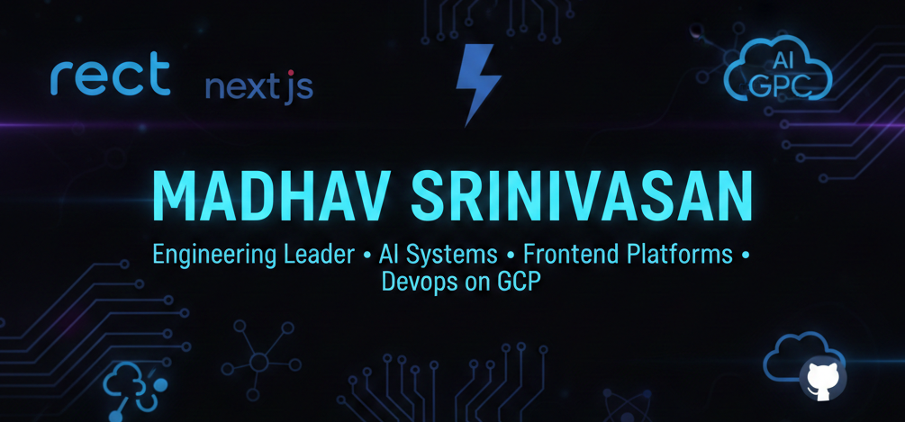

  

# 👋 Hi, I'm **Madhav Srinivasan**
**Senior Director of Engineering | AI Systems Architect | Frontend Platform Leader | DevOps Transformation on GCP**

I build and scale high-performing engineering organizations that deliver modern frontend platforms, enterprise-grade AI systems, and mission-critical digital experiences. My work spans AI agents, voice systems, React/Next.js architectures, DevOps acceleration, and organizational design for engineering velocity.

I enjoy solving ambiguous, high-impact problems and driving zero-to-one initiatives from concept to production.

---

## 🧭 Leadership Focus Areas
### **AI & Agentic Systems**
- Led development of enterprise Conversational AI/Voice Agents (Grace) and multimodal digital agents (Ascension Companion)  
- Architect AI platforms using Claude Sonnet, Gemini 2.5, Deepgram, ElevenLabs, Vertex, MCP tool calling, evaluations, RAG  
- Established enterprise processes for **AI safety, observability, governance, and PHI/PII compliance**

### **Frontend Platform Engineering**
- Scale Next.js + React architectures serving millions of users  
- Lead development of an enterprise design system (Helix)  
- Drive accessibility, performance, reliability, and SEO excellence

### **DevOps & Cloud Engineering**
- Modernizing infrastructure from PCF to GCP native (GKE, Cloud Build, Cloud Deploy, Terraform)  
- Nx monorepo acceleration, CI/CD optimization, and engineering productivity improvements  
- Build systems that reduce build times, remove operational drag, and improve stability

### **Organizational Leadership**
- Lead multi-disciplinary engineering teams (frontend, AI, platform, DevOps)  
- Build culture around accountability, clarity, engineering excellence  
- Lead zero-to-one initiatives in ambiguous problem spaces  
- Partner with Product, Design, Compliance, Call Center Ops, and Marketing to deliver enterprise outcomes

---

## 🛠️ Technical Expertise

### **Core Stack**

  &nbsp;
  &nbsp;
  &nbsp;
  &nbsp;
  &nbsp;
  

### **AI & Conversational Technologies**

  &nbsp; <!-- Anthropic -->
  &nbsp; <!-- Gemini -->
  &nbsp; <!-- Deepgram -->
  &nbsp; <!-- ElevenLabs -->

### **DevOps / Platform**

  &nbsp;
  &nbsp;
  &nbsp;
  &nbsp;
  

---

## 📈 Engineering Impact (Selected)
- Built a Conversational AI platform decreasing cost per call from ~$0.30/min to ~$0.03/min  
- Increased engineering velocity across frontend & DevOps teams through monorepo strategy and CI/CD optimization  
- Led redesign of enterprise digital experience stack with Next.js, dramatically improving performance & SEO  
- Built multi-agent, evaluation-first architecture for healthcare workflows with PHI-compliant pipelines  
- Scaled engineering teams, improved hiring quality, and instituted modern engineering practices  

---

## 📊 GitHub Metrics

  
  

---

## 🔗 Connect

  

